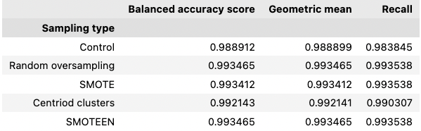

# Fintech--Classification
Classification models and resampling techniques have been used to identify high risk loans in imbalanced data sets. The resampling notebook explores the use of oversampling, undersampling and combination sampling, coupled with a logistic regression model for prediction of loan risk. The ensemble notebook looks at ensemble learning techniques and how they handle imbalanced datasets.

All non, neumerical data was encoded using the sklearn LabelEncoder, the data was then scaled accordingly with sklearn StandardScaler.

---
## Credit risk resampling

Resampling techniques from the imblearn resampling library, were compared using an imbalanced loanbook. 

### Oversampling
Two techniquies were used for oversampling, the first method used a random oversampler for duplication of datapoints as the input to the regression model. The second technique was [Synthetic Minority Over-sampling Technique (SMOTE)](https://www.jair.org/index.php/jair/article/view/10302).

### Undersampling
Undersampling used a Centroid clusters algorthm, which undersamples by computing k-means and replacing the cluster with the central point of the cluster.

### Combination sampling
The SMOTE combined with Edited Nearest Neighbours (SMOTEENN) was the algorithm of choise for combination resampling as it uses a combination of SMOTE and k-means clustering for over and under sampling.

---
## Comparing sampling methods

The table above (table 1) outlines the metrics for logistic regression models built with the sampling techniques. It is evident that there is quite a bit of overlap between the techniques. The oversampling and combination techniques often resulted in a model with very similar performance. All resampling methods had improved performance when compared to the control.

n.b. The random states used for these models have been controlled, slight variance between model performance was observed when random stats were changed.

## Questions

1. Which model had the best balanced accuracy score?

    The random oversampler and the SMOTEENN algorithm tied for the best balanced accuracy score of 0.99347.   

2. Which model had the best recall score?

    For this particular random state, both oversampling techniques (random over sampling and SMOTE), and the combined sampling method (SMOTEENN) all performed equivalently with a recall of 0.93538.

3. Which model had the best geometric mean score?

    Similar to the accuracy score, the random oversampler and SMOTEENN both had geometric mean of 0.99347.

---
# Ensemble learning
A balanced random forest classifier was compared to the EasyEnsembleClassifier for the purposed of building an ensemble model for predicting loan risk. The balanced random forest classifier implements undersampling of bootstrapped samples to build a random forest classifier. Alternativly, the EasyEnsembleClassifier uses a combination of AdaBoost learners and random under sampling techniques for improved performance.

## Comparing models

1. Which model had the best balanced accuracy score?

    The easy ensemble classifier performed significantly better than the balanced random forest, with a balanced accuracy score of 0.93

2. Which model had the best recall score?

    Again, the easy ensemble classifier, performed better at minimising incorrect predictions of high risk loans with a recall of 0.94

3. Which model had the best geometric mean score?

    A geometric mean of 0.93 for the easy ensemble classifier places it firmly above the balanced random forest classifier.

4. What are the top three features?

    The three most important features according to the balanced random forest classifier were:
    - total_rec_prncp
    - last_pymnt_amnt
    - total_pymnt

